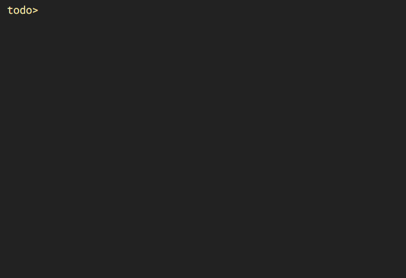

# todo [](https://travis-ci.org/gaborbata/todo) 

todo list manager inspired by [todo.txt](http://todotxt.org) using the [jsonl](http://jsonlines.org) format

```
Usage: todo <command> <arguments>

Commands:
* add <text>                     add new task
* start <tasknumber>             mark task as started
* done <tasknumber>              mark task as completed
* block <tasknumber>             mark task as blocked
* reset <tasknumber>             reset task to new state
* prio <tasknumber>              toggle high priority flag
* due <tasknumber> <date>        set due date (in YYYY-MM-DD format)

* append <tasknumber> <text>     append text to task title
* rename <tasknumber> <text>     rename task
* del <tasknumber>               delete task
* note <tasknumber> <text>       add note to task
* delnote <tasknumber>           delete all notes from task

* list <regex> [regex...]        list tasks (only active tasks by default)
* show <tasknumber>              show all task details
* repl                           enter read–eval–print loop mode
* help                           this help screen

With list command the following pre-defined regex patterns can be also used:
:active, :done, :blocked, :started, :new, :all

Legend:
new [ ], done [x], started [>], blocked [!], priority *
```

`todo.jsonl` file stores the todo data which is saved into the `$HOME` folder of the current user.

## How to install

```
gem install todo-jsonl
```

## Demo



## Requirements

Ruby 2.5 or newer
